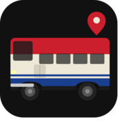

  

<h1 align="center">RapidKL Bus Tracker</h1>

  <strong>Live bus tracking for Kuala Lumpur &mdash; see every bus on a map, get GPS-based ETAs, one tap from your home screen.</strong>

  <a href="https://imrnmzri.github.io/bus-dashboard"><strong>Open the Dashboard</strong></a>
  &nbsp;&middot;&nbsp;
  <a href="#save-it-to-your-phone">Save to Your Phone</a>
  &nbsp;&middot;&nbsp;
  <a href="#faq">FAQ</a>

  
  
  

---

## What It Does

**See every bus on a live map.** Buses update every few seconds — tap any one to see its plate number, speed, and last location.

**GPS-based ETAs.** When a bus is on the road, the dashboard measures the actual road distance from the bus to your stop and converts it to minutes. No guesswork from a fixed timetable.

**One tap from anywhere.** Save your regular route and stop once. After that, open the dashboard and tap your saved pill — you're looking at your next bus in seconds. No menus, no typing, no login.

**Free. No ads. No app store.** Just a website that works on any phone, tablet, or desktop. Add it to your home screen and it opens fullscreen like any other app.

## How to Use

### 1. Open the dashboard
Tap the link above on your phone or desktop. Every active RapidKL bus appears on the map.

### 2. Choose your route
Pick your bus from the dropdown. The map zooms in and draws the exact path it follows.

### 3. Choose your stop
Select where you're waiting. The bottom bar shows minutes until the next bus.

### 4. Read the ETA
**Green** means there's a bus on the road and the time is from its GPS. **White** means no bus is nearby, so it's showing the schedule.

### 5. Save your stop
Tap the **+** to save this route and stop. It appears as a pill at the top — tap it anytime to jump straight back.

### 6. Tap a bus
Tap any bus icon on the map to see its plate number, speed, and last update.

---

## Save It to Your Phone

Works like a normal app — no app store required.

| Platform | Steps |
|----------|-------|
| **iPhone / iPad** | Open in Safari → Tap **Share** → **Add to Home Screen** |
| **Android** | Open in Chrome → Tap **⋮** → **Add to Home Screen** |

It opens fullscreen without browser tabs or address bars. Works offline for schedules too.

---

## FAQ

**Why is the time white instead of green?**  
Green means a bus is actually on the road heading toward you. White means no bus is currently nearby, so it's showing the official schedule instead.

**Does it work without internet?**  
Schedules are saved on your phone. Live bus positions need a connection.

**Where does the data come from?**  
Live bus positions come from Prasarana's official real-time feed. Routes and schedules come from Malaysia's [Open API](https://developer.data.gov.my/). Everything is public open data — nothing is scraped.

**Who made this?**  
A bus rider who got tired of guessing whether to run for the stop or wait for the next one.

---

  MIT License &middot; <a href="https://github.com/imrnmzri/bus-dashboard">Source on GitHub</a>

